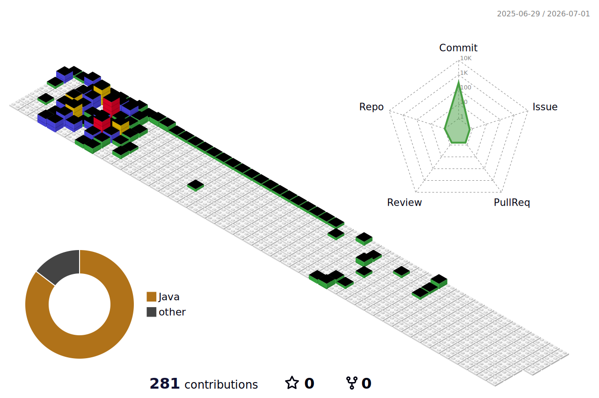

	

👋 Hello, My name is Dain.
---
Hi, there!  
I am a Caffeine-powered Code Machine 🧙☕  
Specialized in Java and Web Front-end Development💻  

- 💡 Always trying to learn more :)
- 🔥 Passionate about Movies and Books
- 💻 Good in Java, JavaScript, and modern front-end frameworks
- 🌍 Currently exploring AWS and Linux
- 📚 Enjoy Reading & writing blogs on Tistory

 

📫 Contact Me on: 
---
✉️ E-Mail ↓

  

📰 Tistory blog  
🌐 개인 위키 ↓ 

 

✨ Primary Tech stack:
---

	
	
	
	
	
	
	
	 
	
	
	
	
	
	
	 
	
	
	
	
		

	
 
 

🔥 My Stats:
---

 💀 GitHub Stats 💀 

 
 

🏆 Baekjoon solved rank 🏆

	

<!--
 
 

  

  

  

  

  

  

  

  

-->

<!--

⚡ Certifications:
---
- TOEIC 955
- TEPS 2급
- Linux master 2급
- SQL Developer
- 워드프로세서 단일등급
- 컴퓨터 활용능력 2급
 

🚀 정보처리기사('24), SQLDeveloper ('24). 

👨‍💻 전자계산기조직응용기사 필기합격, 웹디자인기능사 필기합격, 리눅스마스터2급 ('23). 

💡 워드프로세서단일등급('19), 컴퓨터활용능력2급('20).

💬 Very Fluent in English TOEIC 955('22)

🧞‍♀️ Front-end wizard by day, caffeine-powered code machine by night! ☕️

 
 

**awesomepossumgirl/awesomepossumgirl** is a ✨ _special_ ✨ repository because its `README.md` (this file) appears on your GitHub profile.

Here are some ideas to get you started:

- 🔭 I’m currently working on ...
- 🌱 I’m currently learning ...
- 👯 I’m looking to collaborate on ...
- 🤔 I’m looking for help with ...
- 💬 Ask me about ...
- 📫 How to reach me: ...
- 😄 Pronouns: ...
- ⚡ Fun fact: ...

 - Linux Master

 🚀 Full-stack wizard by day, caffeine-powered code machine by night! ☕️

👨‍💻 Breaking keyboards and fixing bugs since '23.

💡 Fluent in Java, Python, JavaScript, and sarcasm. Proficient in turning coffee into code.

🎮 When not coding, you'll find me in the gaming realm, defeating dragons.

🚴‍♂️ Enthusiastic hiker who believes that a good hiking can solve any coding conundrum.

💬 Let's turn coffee into code, errors into lessons, and meetings into memes! 😄

 

 
-->

